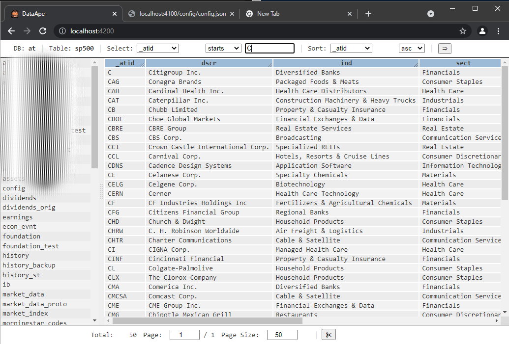

# data-ape
An optionally containerized database GUI for your browser.

### What's the point?
Existing tools didn't cut it for our use case of quickly reviewing database content for development and troubleshooting (i.e. processes that are either/or slow, clunky, expensive, annoy with licensing or use up too many resources on a Dev VM). So we spent a bit of time to write a web browser based tool and deploy it into an always-on Docker container. Now it even runs on the smarphone - as long as it's on the same network (we advise against running this tool on public/insecure environments!)

This tool is mostly aimed at no-sql databases such as (for now only) MongoDB with support for simple filtering and sorting and primitive data types. It should be easy to extend to SQL databases, CSV files or wherever data is stored as long as it can be represented in tabular text. It's great for time series.

Unterlying code is Java for the server and TypeScript/Angular (no Material) for the web GUI - since these technologies are currently being used in our main projects.

This tool may expose your data due to improper configuration or bugs. Use at your own risk!

### Instructions

For now this only works with MongoDB and one database defined in the properties:

1. Build GUI:
   - cd da-frontend
   - ng build --configuration production --progress --verbose
2. Build & package server:
   - cd da-server
   - mvn package
3. This should yield in da-server/target a server jar and a docker image tarball.

#### To run on system:

4. Create a NOCHECKIN_da.properties file populated with the commented out 'mongo.*' properties (from da-server/da.properties) in the data-ape dir
4. cd to da-server
6. Run: java -Dlogback.configurationFile=./da-logback.xml -jar ./target/da-server-1.0.0-SNAPSHOT-jar-with-dependencies.jar ../NOCHECKIN_da.properties,./da.properties

#### To run in Docker:

4. Import the da-server/target/da-server.docker.tar imaage.
5. Create & prepare a docker volume (assuming default locations):
   - docker volume create data-ape
   - mkdir /var/lib/docker/volumes/data-ape/_data/config
   - mkdir /var/lib/docker/volumes/data-ape/_data/logs
   - mkdir /var/lib/docker/volumes/data-ape/_data/web_config
6. Prepare config files:
   - Copy da.properties from da-server into the new config dir
   - Create a NOCHECKIN_da.properties file populated with the commented out 'mongo.*' properties (from da-server/da.properties) in the new config dir
   - Create a da-config.json file in web_config and populate it as per example (also see Tips below)
7. Create a docker container:
   - docker run -d --name data-ape --restart=always -p 888:4100 --mount type=volume,source=data-ape,target=/docker-data/data-ape da-server:1.0.0-SNAPSHOT

Missing features can be added if there is interest and related submissions are welcome.

### Features:
   - Select, view and page through tabular data (database table, etc)
   - Query data with filters in GUI
   - Light-weight JSON based record editing; Record deletion
   - Query through URL. Example:  
     http://&lt;host&gt;:&lt;port&gt;/?db=my_db&table=my_table&page=2&pageSize=40&sort=[{"key":"name","dir":"-1"}]&select=[{"key":"name","op":"stw","val":"A"}]&highlight=London
   - Sort data in GUI. Optionally define default sort per db/table in config file
   - Export result as CSV to Clipboard
   - Order columns with drag & drop. Optionally define default order per db/table in config file
   - Hide/View columns (right-click). Optionally define default hide/view columns per db/table in config file
   - Session persistenve of select/sort/paging/highlight per table to conveniently switch between views
   - Highlight related cells on click (aid tracing in time-series etc)

### Roadmap:
   - Tabs (or a practical alternative) to keep several table views open (Session persistence of select/sort/paging/highlight lowers priority of tabs)
   - Check feasibility of conversion functions for table columns (example: eopch timestamp -> readable date)
   - Deal with non-primitive and nested data columns
   - Create dockerfile for build
   - Persist and GUI-edit configuration
   - Add secrurity/login (not required for now and may add complexity to deployment, maintenance and usage)

### Tips
   - To easily define order/hide/view columns in the config file, first arrange the view in the GUI, then export to CSV and copy the headers into the config columns.

#### Thanks for looking!
